# Research-on-Deep-Denoising

The architecture was inspired by [U-Net: Convolutional Networks for Biomedical Image Segmentation](http://lmb.informatik.uni-freiburg.de/people/ronneber/u-net/).

---

## Overview

### Pytorch Version
#### Dependencies

This tutorial depends on the following libraries:

* Pytorch
* Numpy

#### Training

python ./Pytorch_V1/train.py

#### Testing
python ./Pytorch_V1/test.py

##### Results

Use the trained model to denoise self-synthesied noisy 1D signals. Network is programed by Pytorch.
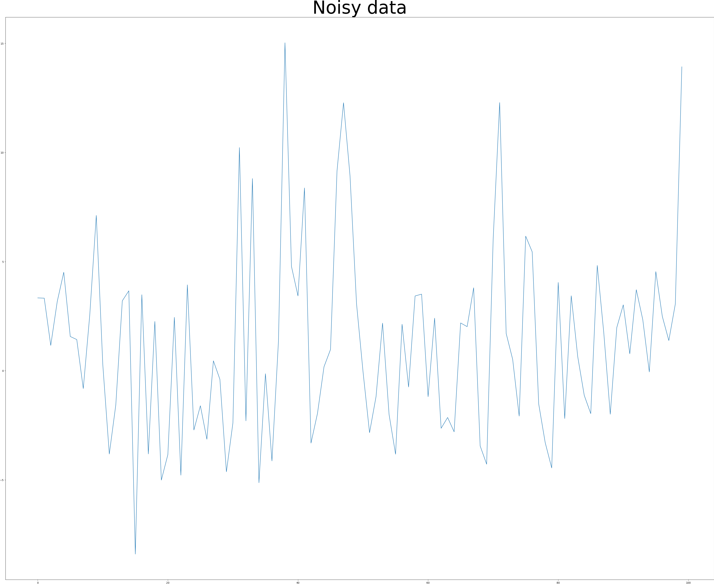
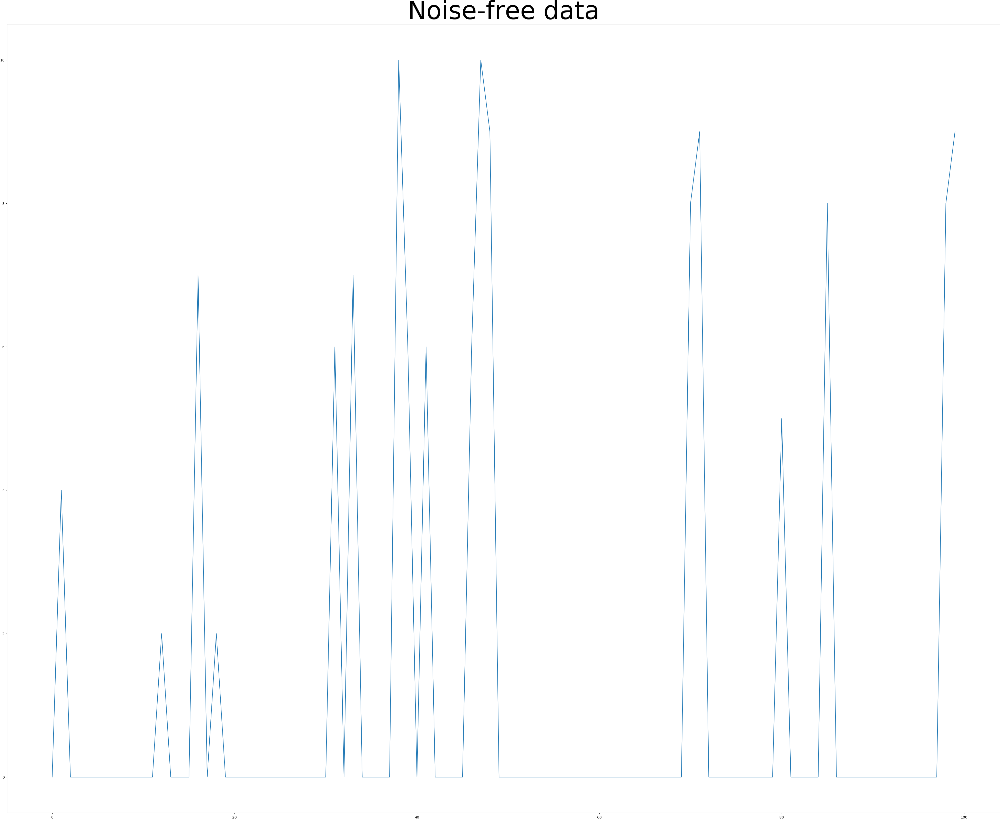
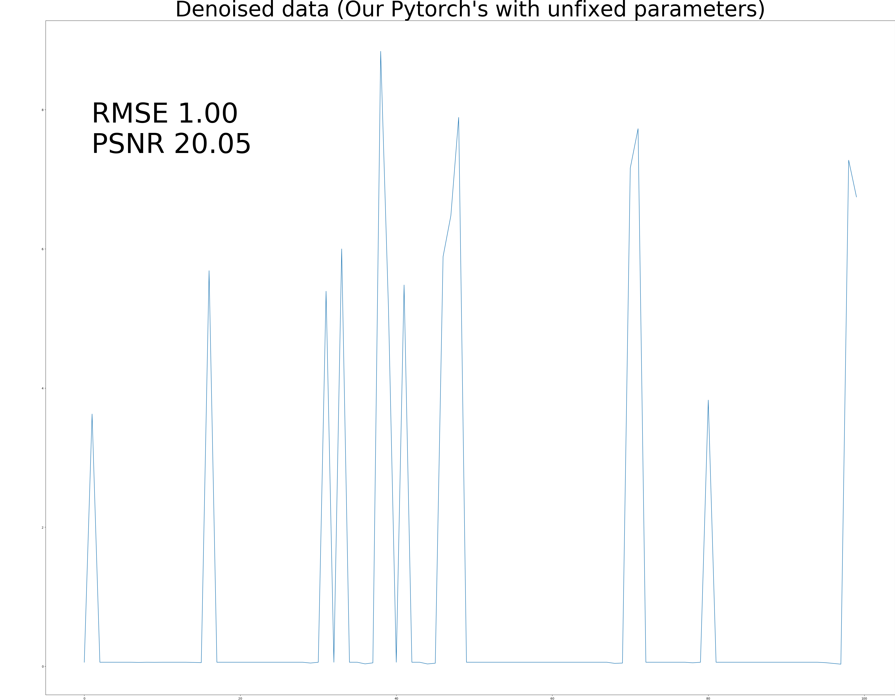
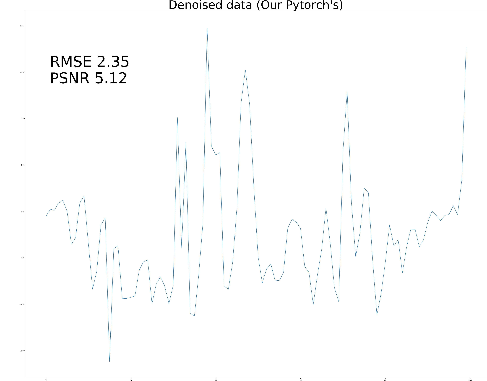
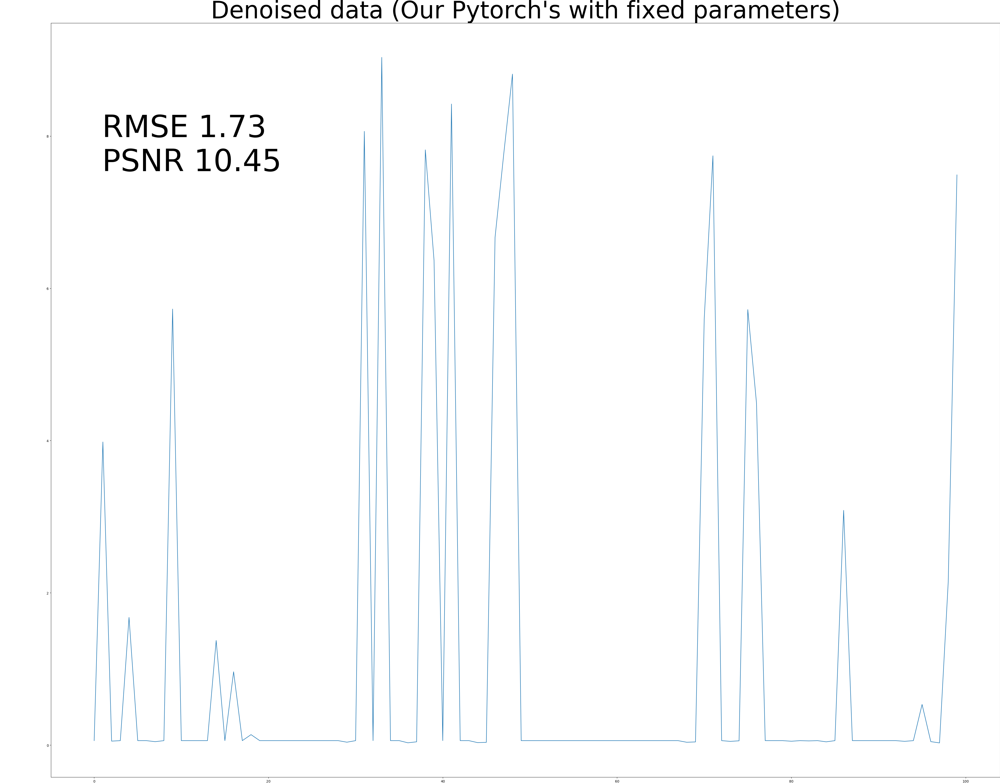

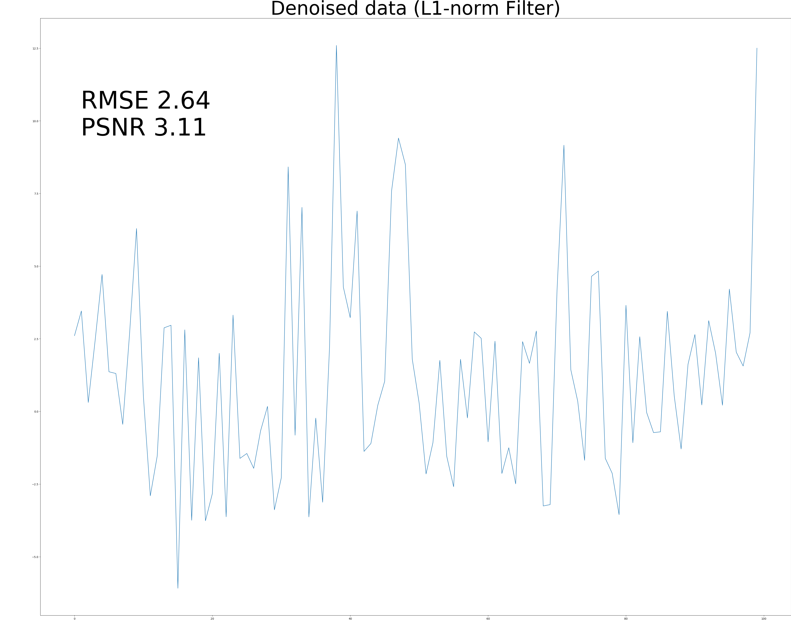

### Numpy Version
#### Dependencies
* Numpy
* skimage
* h5py

#### Coverting pretrained model into hf files
python pth2h5.py

### Testing
python ./Numpy_V2/Numpy_test.py

#### Results
Use the trained model to denoise self-synthesied noisy 1D signals. Network is programed by Numpy.
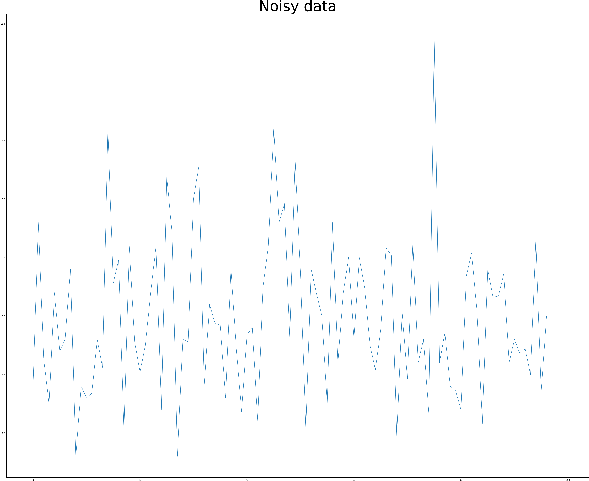
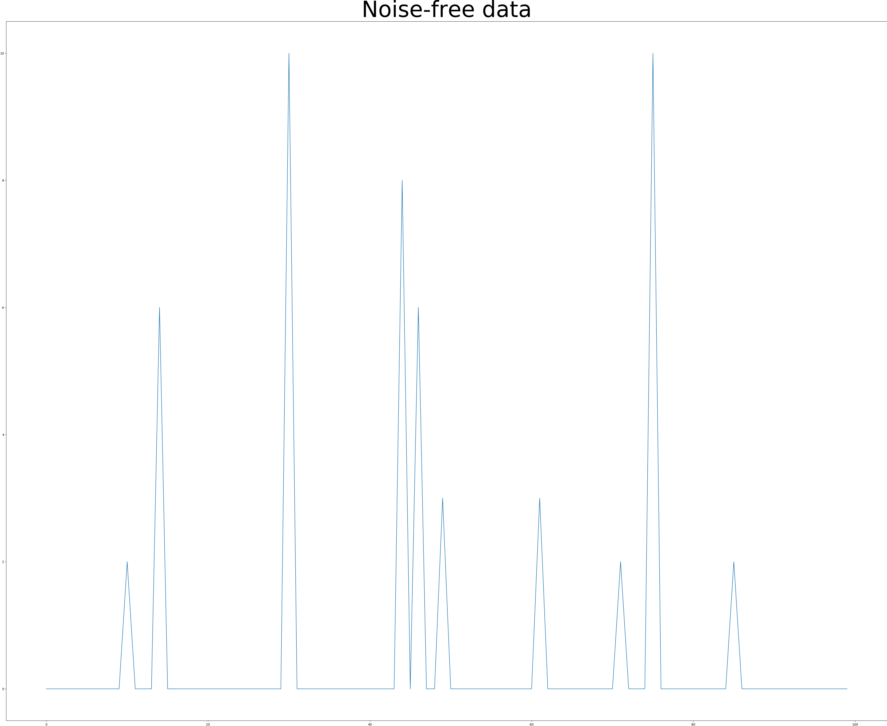
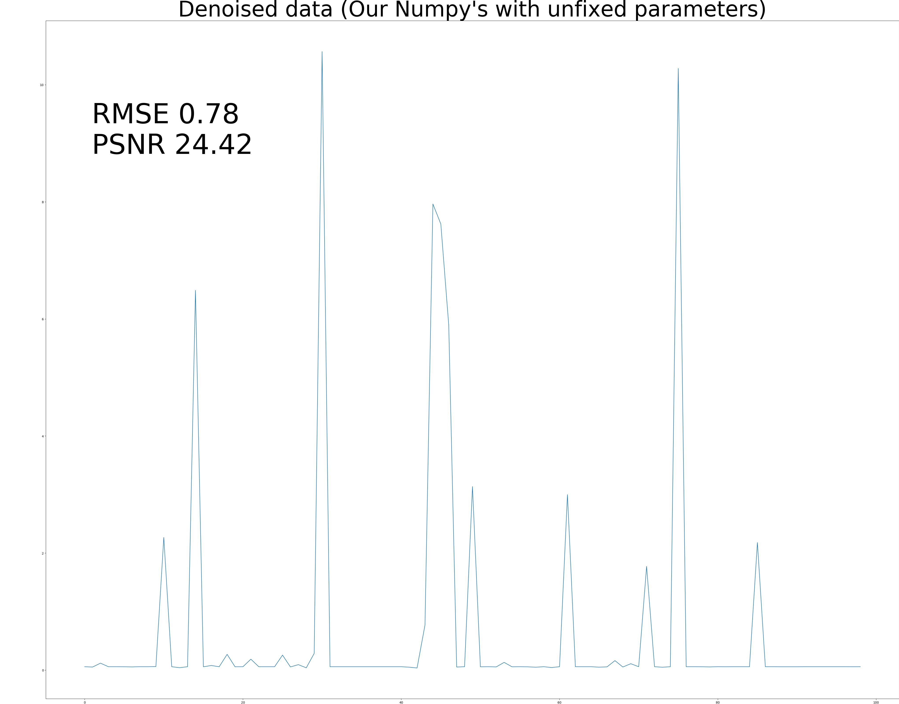
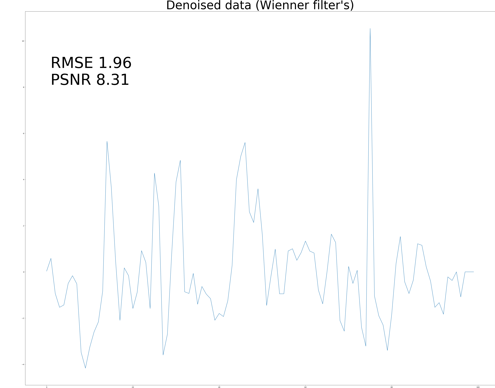
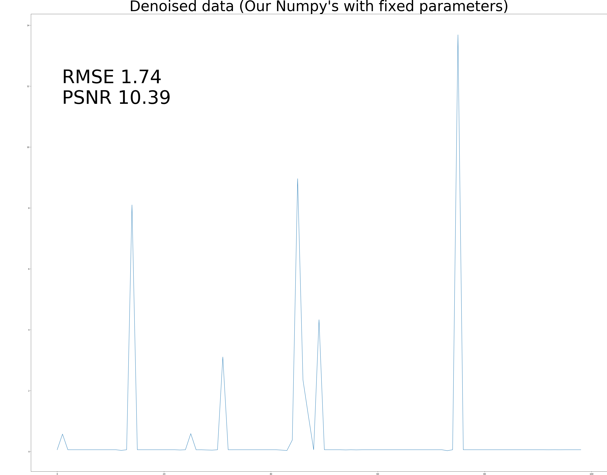

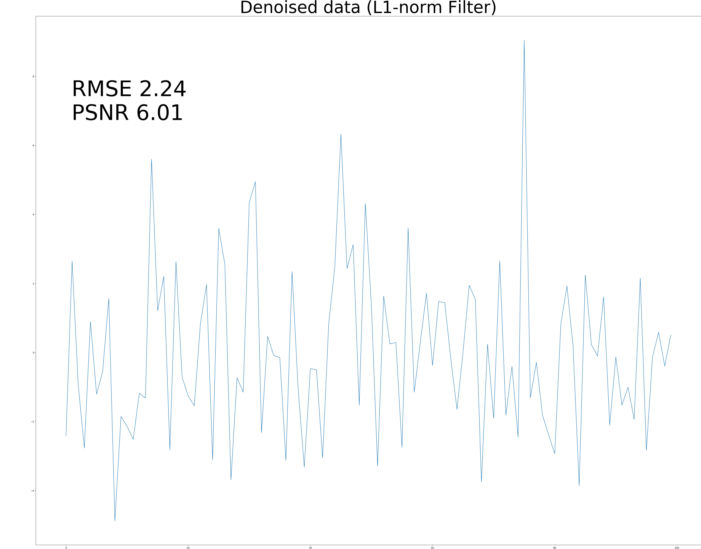
